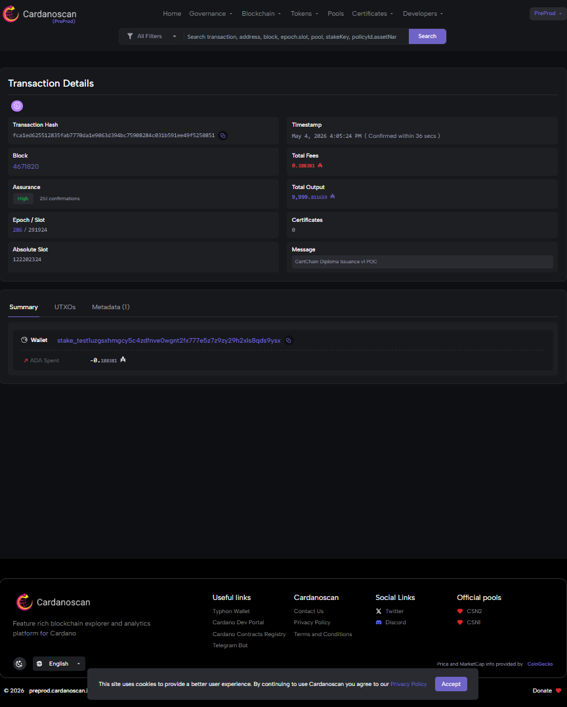
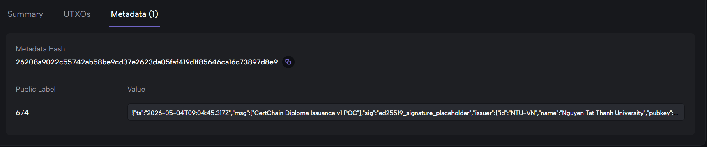

# CertChain 🎓

> Tamper-proof educational credentials on Cardano blockchain. Verify diplomas in 2 seconds via QR code.

**Built for**: Cardano SEA Hackathon 2026
**Status**: 🚧 In active development (M1 — POC Stage)

## Problem

- Vietnam has ~600,000 university graduates per year, with thousands of fake diploma cases annually
- Employers spend 5-15 days verifying diplomas through formal letters
- Students studying/working abroad pay $20-80 per diploma legalization, taking 2-4 weeks

## Solution

CertChain issues educational credentials as immutable records on Cardano blockchain using transaction metadata (CIP-20). Each diploma gets a QR code that anyone can scan to verify authenticity in 2 seconds.

## How it works

```
┌─────────────┐      ┌──────────────┐      ┌─────────────┐
│  University │─────▶│ CertChain    │─────▶│  Cardano    │
│  (Issuer)   │      │ Issuer Portal│      │  Blockchain │
└─────────────┘      └──────────────┘      └─────────────┘
                                                   │
                                                   ▼
                                            ┌─────────────┐
                                            │   Student   │
                                            │ (QR Code)   │
                                            └─────────────┘
                                                   │
                                                   ▼
                                            ┌─────────────┐
                                            │  Employer   │
                                            │ (Verifier)  │
                                            └─────────────┘
```
## 🎯 Proof of Concept (M1 Completed - 04/05/2026)

✅ Successfully deployed CertChain metadata transaction to **Cardano Preprod testnet**:

- **TxHash**: `fca1ed625512835fab7770da1e9063d394bc75908284c031b591ee49f5250851`
- **Cardanoscan**: [View transaction](https://preprod.cardanoscan.io/transaction/fca1ed625512835fab7770da1e9063d394bc75908284c031b591ee49f5250851)
- **Cexplorer**: [View transaction](https://preprod.cexplorer.io/tx/fca1ed625512835fab7770da1e9063d394bc75908284c031b591ee49f5250851)
- **Network**: Cardano Preprod
- **Standard**: CIP-20 transaction metadata
- **Cost**: ~0.17 ADA per credential issuance

### What this proves
- ✅ **Issuer flow**: University can sign and submit credentials on-chain
- ✅ **Verifier flow**: Anyone can fetch and verify credentials in seconds
- ✅ **Tamper-proof**: Metadata is immutable on Cardano blockchain

### Screenshots


## Tech Stack

- **Frontend**: React 19 + Vite + Tailwind CSS
- **Backend**: FastAPI + PostgreSQL
- **Blockchain**: Cardano (Preprod Testnet) via Mesh.js SDK
- **AI**: Qwen-VL for OCR & fraud detection
- **Standard**: CIP-20 transaction metadata (no smart contracts needed)

## Project Structure

```
certchain/
├── scripts/              # POC scripts & utilities
│   └── hello-cardano.ts  # M1 POC: submit metadata transaction
├── frontend-issuer/      # University portal (M3-M4)
├── frontend-verifier/    # Employer mobile PWA (M3-M4)
├── backend/              # FastAPI service (M3)
├── docs/                 # Project docs
└── PROJECT_CONTEXT.md    # Full project context
```

## Getting Started (M1 — POC)

```bash
# Install dependencies
npm install

# Set up environment
cp .env.example .env
# Edit .env with your wallet seed + Blockfrost API key

# Run hello-cardano POC
npm run hello
```

## Roadmap

- [x] M1: Setup + Hello Cardano POC
- [ ] M2: Vòng 1 idea proposal submission (deadline 08/05/2026)
- [ ] M3: Backend MVP — issue diploma via API
- [ ] M4: Frontend MVP + V2 detailed proposal (deadline 17/05/2026)
- [ ] M5: AI integration (Qwen-VL OCR)
- [ ] M6: 24h Final Hackathon (26-27/05/2026)

## Author

**Huy** ([@Hunny-17](https://github.com/Hunny-17))
Computer Science, Văn Hiến University

## License

MIT
