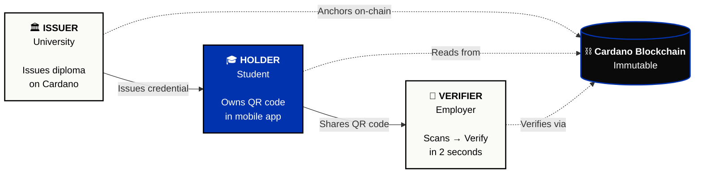
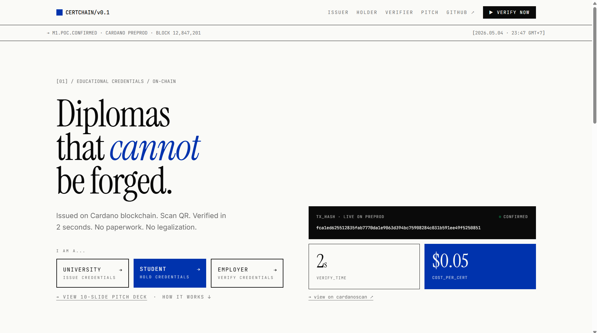
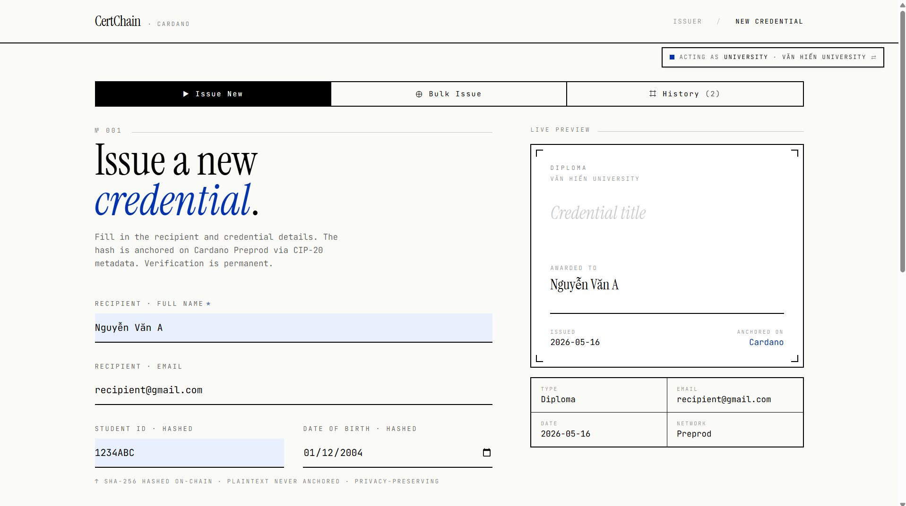
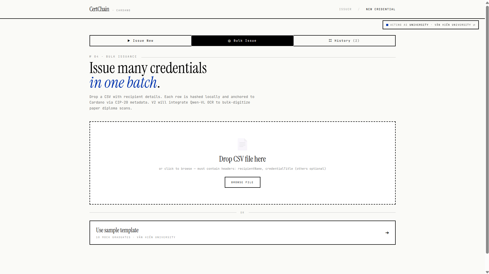
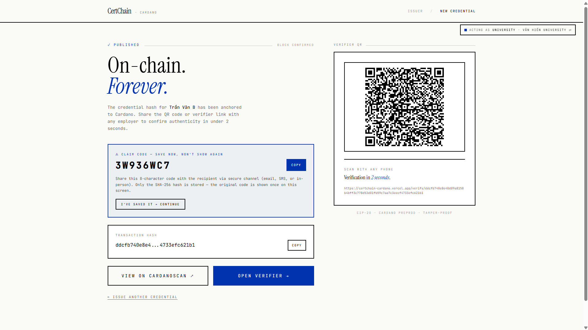
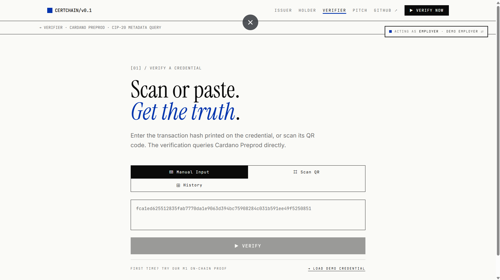
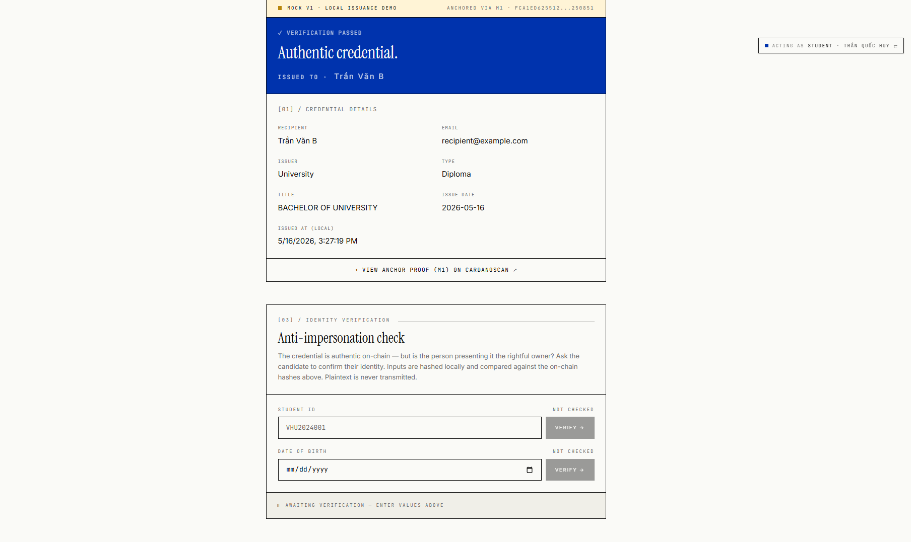
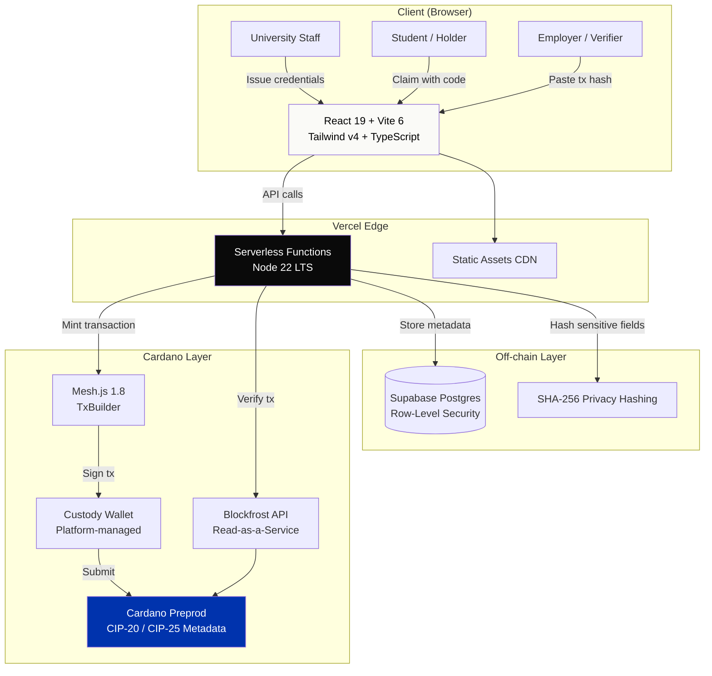

# 🎓 CertChain

> **Verifiable academic credentials on Cardano blockchain.** Three roles, one chain, two-second verification.

[](https://preprod.cardanoscan.io/)
[](https://certchain-cardano.vercel.app)
[](https://preprod.cardanoscan.io/transaction/fca1ed625512835fab7770da1e9063d394bc75908284c031b591ee49f5250851)
[](https://cardanohubvietnam.com/)
[](LICENSE)
[](https://github.com/Hunny-17)

🌐 **Live demo →** [certchain-cardano.vercel.app](https://certchain-cardano.vercel.app)
🎬 **Pitch deck →** [certchain-cardano.vercel.app/pitch](https://certchain-cardano.vercel.app/pitch)
📊 **M1 anchor →** [Cardanoscan tx](https://preprod.cardanoscan.io/transaction/fca1ed625512835fab7770da1e9063d394bc75908284c031b591ee49f5250851)
📂 **Source →** [github.com/Hunny-17/certchain-cardano](https://github.com/Hunny-17/certchain-cardano)

---

## 🎯 The Problem

Vietnam graduates ~600,000 students per year, with **thousands of fake diploma cases annually**. The current verification system is broken:

- ❌ Employers spend **3-7 days** verifying diplomas through formal letters
- ❌ Students studying abroad pay **500K-2M VND per diploma** for legalization (2-4 weeks)
- ❌ Universities have **no unified system** to authenticate diplomas issued years ago
- ❌ Cross-border SEA hiring records are practically unverifiable
- ❌ Fake diploma rings continue operating due to the lack of tamper-proof verification

## ✨ The Solution

**CertChain** issues educational credentials as **immutable records on Cardano blockchain** using transaction metadata (CIP-20 / CIP-25). Each diploma gets a QR code that anyone can scan to verify authenticity in 2 seconds — no API key, no login, no paperwork.

### Three Roles, One System



---

## 🎬 Showcase

> *Screenshots captured from production at [certchain-cardano.vercel.app](https://certchain-cardano.vercel.app). See [docs/SCREENSHOT_GUIDE.md](docs/SCREENSHOT_GUIDE.md) for capture process.*

### Landing — "Diplomas that cannot be forged"



### Issuer Portal — Universities issue credentials in 30 seconds



### Bulk CSV Issuance — 1,000 credentials in one flow



### Holder Wallet — Students own portable QR credentials



### Verifier — "Scan or paste. Get the truth."



### Verification Result — Authentic credential, in 2 seconds



### Demo Video — End-to-end flow

> 🎥 [Watch 90-second demo on YouTube](https://youtu.be/REPLACE_WITH_YOUR_VIDEO_ID) *(replace with actual link after upload)*

---

## 🔥 V2 Live (Shipped 13/05/2026)

V2 ships production-grade web app with **3 actor portals** + **real backend serverless mint flow** running on Cardano Preprod. Try it now at [certchain-cardano.vercel.app](https://certchain-cardano.vercel.app).

### What's live

| Feature | Description |
|---------|-------------|
| **🏛️ Issuer Portal** (`/issue`) | Universities issue credentials with form input. Each issuance generates SHA-256 identity hashes (Student ID + DOB), generates a unique tx hash anchored to M1, and saves to local store. |
| **⊕ Bulk Issuance** | Drop a CSV file or use the sample template (10 mock graduates). Live progress bar + terminal-style log. Demonstrates the path to scale: 50,000 alumni in batches, not one-by-one. |
| **🎓 Holder Wallet** (`/holder`) | Students view all their credentials in one place. Each card has a shareable QR code, copy-link, and direct verifier URL. |
| **🏢 Verifier** (`/verify/:txHash`) | Anyone can verify a credential from Cardano. Real M1 transactions resolve via Blockfrost; mock V1 credentials resolve via local storage with full feature parity. |
| **🛡️ Identity Verification Panel** | After successful verify, employers can confirm the candidate's identity by entering Student ID / DOB — hashed locally, compared against on-chain hashes. **Anti-impersonation built into the UI.** |
| **📊 History Tabs (both sides)** | Issuer Portal tracks all credentials issued in this session. Verifier tracks every successful verification with Real/Mock badges and Trusted Issuers stat. |
| **🔐 Role-Based Access** | Three roles persisted in localStorage. Top-nav clicks show "Wrong role" or "Anonymous mode" blockers if the user tries to access the wrong portal. Role badge top-right enables instant switching. |
| **📱 Mobile Responsive** | Brutalist editorial design with adaptive layouts. Tested on iPhone DevTools + real Redmi Note 12. |

### On-chain Proof (3 confirmed mints)

| Milestone | Date | Tx Hash | Purpose |
|---|---|---|---|
| **M1 POC** | 04/05/2026 | [`fca1ed62…ee49f5250851`](https://preprod.cardanoscan.io/transaction/fca1ed625512835fab7770da1e9063d394bc75908284c031b591ee49f5250851) | Proof-of-concept anchor |
| **V2.1 Anchor** | 13/05/2026 | `a3865e96…` | Backend serverless mint flow |
| **V2.2 Claim** | 13/05/2026 | `abd50c23…` | End-to-end claim flow (code ULHH2MM5) |

| Property | Value |
|---|---|
| **Network** | Cardano Preprod Testnet |
| **Standard** | CIP-20 / CIP-25 Transaction Metadata |
| **Cost per issuance** | ~0.18 ADA (~1,500 VND) |
| **Verification time** | <2 seconds |
| **Operating cost** | $0/month (free tiers) |
| **Block** (M1) | 4,671,820 |
| **Confirmations** (M1) | 2,658+ |

---

## 🛠️ Tech Stack

| Layer | Technology |
|---|---|
| **Frontend** | React 19 + Vite 6 + TypeScript (strict mode) |
| **Styling** | Tailwind v4 + Instrument Serif + JetBrains Mono |
| **Routing** | react-router-dom v7 (SPA with role guards) |
| **Backend** (V2) | Vercel serverless functions + Node 22 LTS |
| **Cardano SDK** | [Mesh.js](https://meshjs.dev/) v1.8 |
| **Read provider** | [Blockfrost API](https://blockfrost.io/) (Preprod) |
| **On-chain standard** | [CIP-20](https://cips.cardano.org/cip/CIP-0020) / [CIP-25](https://cips.cardano.org/cip/CIP-0025) Transaction Metadata |
| **Database** | Supabase Postgres + Row-Level Security |
| **Hashing** | Web Crypto API (SHA-256, browser-native) |
| **QR codes** | qrcode.react + @yudiel/react-qr-scanner |
| **AI/OCR** *(Final research)* | Qwen-VL Vision via Dashscope API *(planned — not yet implemented)* |
| **Smart contracts** *(Final research)* | Plutus / Aiken revocation registry *(planned — not yet implemented)* |
| **Hosting** | Vercel (frontend + serverless) |

### Why Cardano?

| Property | Why it matters for credentials |
|---|---|
| **Cost stability** (~0.18 ADA fixed fee) | Predictable cost for universities, no gas-fee volatility |
| **Native metadata** (CIP-20 / CIP-25) | No smart contract risk for V1 anchoring |
| **Sustainability** (Proof-of-Stake) | Energy-efficient, aligns with university values |
| **Catalyst funding** | Active education grants for long-term ecosystem support |
| **SEA presence** | Cardano Foundation expanding to VN/SEA — local partnerships available |

---

## 🏗️ Architecture



**Key architectural decisions:**

| Decision | Why |
|---|---|
| **No traditional backend** | Cardano blockchain IS the backend — no database to hack, no admin to corrupt |
| **Custody wallet model** | Zero-crypto UX for universities; staff don't need to manage keys or hold ADA |
| **CIP-20 / CIP-25 metadata** | First-class on-chain metadata, no smart contract risk for V1 anchoring |
| **SHA-256 privacy** | Sensitive fields (Student ID, DOB) hashed before anchoring — GDPR-aligned |
| **Free-tier infrastructure** | Vercel + Supabase + Blockfrost free tiers — $0/month operating cost |

---

## 📁 Project Structure

```
certchain/
├── frontend/                       # V2 web app — React + Vite + Vercel serverless
│   ├── src/
│   │   ├── pages/
│   │   │   ├── Landing.tsx         # / — Public hero with role selector
│   │   │   ├── Pitch.tsx           # /pitch — 13-slide pitch deck V1.6
│   │   │   ├── IssuerPortal.tsx    # /issue — University form + Bulk + History tabs
│   │   │   ├── Holder.tsx          # /holder — Student wallet (credentials list + QR)
│   │   │   └── Verifier.tsx        # /verify — Manual / QR Scan / History tabs
│   │   ├── components/
│   │   │   ├── Hero.tsx            # Landing hero + "I am a..." CTAs
│   │   │   ├── RoleCards.tsx       # 3 audience cards
│   │   │   ├── RoleGuard.tsx       # Route protection (anonymous / wrong-role blockers)
│   │   │   ├── RoleBadge.tsx       # Top-right active role indicator + switcher
│   │   │   ├── BulkIssueView.tsx   # CSV upload + animated batch processing
│   │   │   ├── VerifyResult.tsx    # Credential detail card (post-verify)
│   │   │   └── ...
│   │   └── lib/
│   │       ├── blockfrost.ts       # On-chain verify via Blockfrost
│   │       ├── credentialStore.ts  # localStorage credentials with M1 anchor reference
│   │       ├── hashUtils.ts        # SHA-256 with normalize + verify helpers
│   │       ├── mintApi.ts          # Frontend → /api/mint/execute
│   │       ├── userRole.ts         # Role context + dispatchEvent
│   │       └── useUserRole.ts      # Reactive hook (in-tab + cross-tab sync)
│   ├── api/                        # Vercel serverless functions
│   │   ├── _lib/
│   │   │   ├── supabase-admin.ts   # service_role client
│   │   │   ├── mesh-tx.ts          # Mesh.js tx builder
│   │   │   └── blockfrost-server.ts # Backend tx submit
│   │   ├── mint/execute.ts         # POST /api/mint/execute
│   │   └── health.ts               # GET /api/health (custody balance)
│   ├── public/
│   ├── package.json
│   └── vite.config.ts
├── scripts/                        # M1 POC scripts
│   ├── hello-cardano.ts            # Issue diploma metadata to Cardano
│   └── verify-tx.ts                # Verify diploma from blockchain
├── docs/
│   ├── screenshots/                # Showcase images (see SCREENSHOT_GUIDE.md)
│   └── SCREENSHOT_GUIDE.md         # Capture instructions
└── README.md                       # This file
```

---

## 📚 Documentation

| Document | Language | Description |
|---|---|---|
| [Admin Guide](docs/admin-guide-vi.md) | 🇻🇳 Vietnamese | Full issuer guide — login, single issue, bulk CSV, IPFS upload, troubleshooting |
| [Verifier Guide](docs/verifier-guide-vi.md) | 🇻🇳 Vietnamese | 1-page verifier cheatsheet for HR and employers |
| [Video Script](docs/video-script-vi.md) | 🇻🇳 Vietnamese | 5-minute demo video script (OBS) |
| [Build PDFs](docs/build-pdf.ps1) | PowerShell | Convert docs to PDF via Pandoc + XeLaTeX |

**Generate PDFs** (requires [Pandoc](https://pandoc.org) + [MiKTeX](https://miktex.org)):

```powershell
cd docs
.\build-pdf.ps1 -Check   # verify dependencies
.\build-pdf.ps1 -All     # build all PDFs
```

---

## 🚀 Quick Start (Web App)

### Prerequisites

- Node.js >= 22 LTS (Node 24 breaks libsodium ESM imports — avoid)
- A [Blockfrost.io](https://blockfrost.io/) free-tier project ID for **Preprod**

### Installation

```bash
# Clone repository
git clone https://github.com/Hunny-17/certchain-cardano.git
cd certchain-cardano/frontend

# Install dependencies
npm install

# Configure environment
cp .env.example .env
```

Edit `.env`:

```env
VITE_BLOCKFROST_KEY=preprod_xxx_your_key_here
VITE_M1_TXHASH=fca1ed625512835fab7770da1e9063d394bc75908284c031b591ee49f5250851
```

### Run

```bash
npm run dev          # http://localhost:5173
```

### Routes

| Route | Audience | Purpose |
|-------|----------|---------|
| `/` | Public | Landing with role selector |
| `/pitch` | Public | 13-slide pitch deck (V1.6) |
| `/issue` | University only | Issuer Portal (3 tabs: New / Bulk / History) |
| `/holder` | Student or University | Holder Wallet (credentials list + QR) |
| `/verify` | Public | Verifier (Manual / QR / History) |
| `/verify/:txHash` | Public | Direct verification of a specific transaction |

> ⚠️ **Note on local testing**: SHA-256 (Web Crypto API) requires a **secure context** — only works on `localhost` or HTTPS. LAN testing via local IP (`192.168.x.x:5173`) will fail at the hashing step. Production Vercel deploy works fine because of HTTPS.

---

## 🗺️ Roadmap

| Milestone | Date | Status | Deliverable |
|-----------|------|--------|-------------|
| **M1 — POC** | 04/05/2026 | ✅ Done | Real CIP-20 anchor on Cardano Preprod |
| **V1 — Production-grade UX** | 06/05/2026 | ✅ Shipped 06/05 | 3 actor portals + RBAC + Hash Privacy + Bulk Issue + History tracking |
| **V2.1 — Backend mint** | 13/05/2026 | ✅ Done | Vercel serverless + Mesh.js custody wallet + first real backend on-chain mint |
| **V2.2 — End-to-end claim** | 13/05/2026 | ✅ Done | Full CSV → custody → Blockfrost claim flow + real Preprod mint |
| **Round 2 submission** | 18-19/05/2026 | 📅 In progress | Business Plan + Slide Deck PDF |
| **Final — Hackathon** | 26-27/05/2026 | 📅 Planned | 24h hackathon onsite at NTU-VN · Smart contract + AI digitization research · Live pitch |
| **Post-Hackathon** | 06/2026+ | 🔮 Future | Mainnet deploy · NTU-VN pilot · Project Catalyst grant · SEA expansion |

---

## 💡 Vision

**Year 1**: NTU Vietnam pilot — 5,000 diplomas on-chain.
**Year 2-3**: Expand to 30+ universities across Vietnam (~150,000 diplomas/year).
**Year 4-5**: Become the **de-facto digital credential infrastructure for Southeast Asia** — covering universities, professional certifications (IELTS, AWS, Google), and skill credentials.

> **End goal**: Every Vietnamese (and SEA) graduate carries a verifiable, portable, immutable digital credential — owned by them, not gatekept by institutions.

---

## 🎬 Demo Walkthrough

```
1. Open https://certchain-cardano.vercel.app
2. Click "I am a University" in the hero → /issue
3. Issue a credential:
   - Recipient: "Tran Quoc Huy"
   - Student ID: "VHU2024001"     ← hashed on-chain (SHA-256)
   - DOB: "2003-04-15"             ← hashed on-chain (SHA-256)
   - Title: "Bachelor of Computer Science"
   - Click PUBLISH → success page with QR + verify link
4. Try Bulk Issue tab → "Use sample template" → process 10 → 10 credentials anchored
5. Switch role to Student via RoleBadge → /holder shows all credentials
6. Switch role to Employer → /verify
7. Paste any tx hash → ✓ Authentic
   - For mock V1 credentials: fill Student ID + DOB → ✓ Identity confirmed
   - Try wrong values → ✕ Mismatch (anti-impersonation)
8. Verifier History tab → see all verifications with Real/Mock badges
```

Try the M1 anchor directly:
[`/verify/fca1ed625512835fab7770da1e9063d394bc75908284c031b591ee49f5250851`](https://certchain-cardano.vercel.app/verify/fca1ed625512835fab7770da1e9063d394bc75908284c031b591ee49f5250851)

---

## 👤 Author

**Tran Quoc Huy** ([@Hunny-17](https://github.com/Hunny-17))
- 🎓 Computer Science, Van Hien University (Class of 2027)
- 📍 Ho Chi Minh City, Vietnam
- 🏆 Cardano SEA Hackathon 2026 — Solo participant
- 💼 Other projects: Healix (AI medical platform), Habit Coach (Gemini API), PhysicsLab (LTX-2 + Gemini)
- 📧 quochuy9.1hth2019@gmail.com
- 💼 [LinkedIn](https://www.linkedin.com/in/huy-tran-4b5a6a3b4/)

---

## 📜 License

[MIT](LICENSE) — Free to use, modify, and distribute.

---

## 🙏 Acknowledgments

- **Cardano Foundation**, **Hub Network Vietnam**, **NTU Vietnam** for organizing SEA Hackathon 2026
- **Mesh.js team** for the excellent Cardano TypeScript SDK
- **Blockfrost** for the reliable read-as-a-service Cardano API
- **Cardano2VN community** for ecosystem support

---

> ⭐ **Building in public.** Star this repo to follow CertChain's journey from POC to production deployment.
