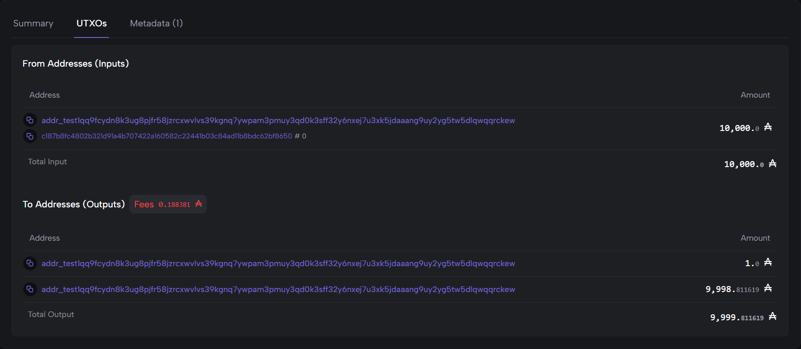

# 🎓 CertChain

> **Tamper-proof educational credentials on Cardano blockchain.** Verify diplomas in 2 seconds via QR code.

[](https://preprod.cardanoscan.io/)
[](#proof-of-concept)
[](https://form.jotform.com/260982100191046)
[](LICENSE)

---

## 🎯 The Problem

Vietnam graduates ~600,000 students per year, with **thousands of fake diploma cases annually**. The current verification system is broken:

- ❌ Employers spend **5-15 days** verifying diplomas through formal letters
- ❌ Students studying abroad pay **500K-2M VND per diploma** for legalization (2-4 weeks)
- ❌ Universities have **no unified system** to authenticate diplomas issued years ago
- ❌ Fake diploma rings continue to operate due to lack of tamper-proof verification

## ✨ The Solution

**CertChain** issues educational credentials as **immutable records on Cardano blockchain** using transaction metadata (CIP-20). Each diploma gets a QR code that anyone can scan to verify authenticity in 2 seconds.

### Three Roles, One System

```
┌─────────────────┐      ┌──────────────────┐      ┌─────────────────┐
│  🏛️  ISSUER     │      │  🎓 HOLDER       │      │  🏢 VERIFIER    │
│  (University)   │─────▶│  (Student)       │─────▶│  (Employer)     │
│                 │      │                  │      │                 │
│  Issues diploma │      │  Owns QR code    │      │  Scans → Verify │
│  on Cardano     │      │  in mobile app   │      │  in 2 seconds   │
└─────────────────┘      └──────────────────┘      └─────────────────┘
                                  ▲
                                  │
                         ┌────────┴──────────┐
                         │ Cardano Blockchain│
                         │  (Immutable)      │
                         └───────────────────┘
```

---

## 🏆 Proof of Concept (M1 Complete — 04/05/2026)

✅ **Successfully deployed CertChain metadata transaction to Cardano Preprod testnet:**

| Property | Value |
|---|---|
| **TxHash** | `fca1ed625512835fab7770da1e9063d394bc75908284c031b591ee49f5250851` |
| **Cardanoscan** | [View Transaction](https://preprod.cardanoscan.io/transaction/fca1ed625512835fab7770da1e9063d394bc75908284c031b591ee49f5250851) |
| **Cexplorer** | [View Transaction](https://preprod.cexplorer.io/tx/fca1ed625512835fab7770da1e9063d394bc75908284c031b591ee49f5250851) |
| **Network** | Cardano Preprod Testnet |
| **Standard** | CIP-20 Transaction Metadata |
| **Cost per issuance** | ~0.17 ADA (~1,500 VND) |

### What this proves

- ✅ **Issuer flow**: University can sign and submit credentials on-chain (`npm run hello`)
- ✅ **Verifier flow**: Anyone can fetch and verify credentials in seconds (`npm run verify`)
- ✅ **Tamper-proof**: Metadata is immutable on Cardano blockchain forever
- ✅ **Cross-border ready**: Public blockchain accessible globally without legalization

### Screenshots


*Transaction confirmed on Cardano Preprod*


*CIP-20 metadata stored immutably*


*Transaction inputs and outputs (UTXO model)*

---

## 🛠️ Tech Stack

| Layer | Technology | Why |
|---|---|---|
| **Frontend** | React 19 + Vite + Tailwind CSS | Modern, fast, mobile-friendly |
| **Verifier** | React PWA + react-qr-scanner | Works offline, installable as app |
| **Backend** | FastAPI + PostgreSQL | _(M3)_ Async, type-safe |
| **Blockchain SDK** | [Mesh.js](https://meshjs.dev/) | TypeScript-first Cardano SDK |
| **Network** | Cardano **Preprod** Testnet | Free, stable for development |
| **On-chain Standard** | [CIP-20](https://cips.cardano.org/cip/CIP-0020) Transaction Metadata | No smart contract required |
| **AI/OCR** | Qwen-VL (Dashscope API) | _(M5)_ Digitize legacy paper diplomas |
| **Wallet** | Lace ([CIP-30](https://cips.cardano.org/cip/CIP-0030)) | Standard Cardano wallet |
| **Deploy** | Vercel + Railway | Free tiers cover MVP |

### Why Cardano?

| Property | Cardano | Why it matters for credentials |
|---|---|---|
| **Cost stability** | ~0.17 ADA fixed fee | Predictable cost for universities |
| **Native metadata** | CIP-20 supported | No smart contract risk |
| **Sustainability** | Proof-of-Stake (energy-efficient) | Aligns with university values |
| **Catalyst funding** | Active grants for education | Long-term ecosystem support |
| **SEA presence** | Cardano Foundation expanding to VN/SEA | Local partnerships available |

---

## 📁 Project Structure

```
certchain/
├── scripts/                  # POC scripts (M1 ✅)
│   ├── hello-cardano.ts      # Issue diploma metadata to Cardano
│   └── verify-tx.ts          # Verify diploma from blockchain
├── frontend/                 # React app (M2-M4)
│   ├── src/
│   │   ├── pages/
│   │   │   ├── Landing.tsx
│   │   │   ├── Issuer.tsx
│   │   │   └── Verifier.tsx
│   │   └── lib/
│   │       └── cardano.ts
├── backend/                  # FastAPI service (M3)
├── docs/                     # Documentation
│   ├── screenshots/          # Cardanoscan proofs
│   └── HOW_IT_WORKS.md       # Detailed flow explanation
├── PROJECT_CONTEXT.md        # Full project context
├── MILESTONE_CHECKLIST.md    # Progress tracker
└── README.md                 # This file
```

---

## 🚀 Quick Start (POC)

### Prerequisites

- Node.js >= 18
- [Lace Wallet](https://www.lace.io/) (switch to Preprod network)
- [Blockfrost.io](https://blockfrost.io/) account (free tier)
- ~5 tADA from [Cardano Faucet](https://docs.cardano.org/cardano-testnets/tools/faucet/)

### Installation

```bash
# Clone repository
git clone https://github.com/Hunny-17/certchain-cardano.git
cd certchain-cardano

# Install dependencies
npm install

# Configure environment
cp .env.example .env
# Edit .env with your wallet mnemonic + Blockfrost API key

# Run POC
npm run hello                  # Issue a test diploma
npm run verify -- <txHash>     # Verify the diploma
```

---

## 🗺️ Roadmap

| Milestone | Status | Description | Deliverable |
|---|---|---|---|
| **M1** | ✅ DONE (04/05) | POC: Submit + verify metadata transaction | TxHash on Cardano Preprod |
| **M2** | 🚧 In progress | V1 Idea Proposal submission | Form submitted by 08/05 |
| **M3** | 📅 09-12/05 | Backend MVP (FastAPI + DB) | API endpoints working |
| **M4** | 📅 13-17/05 | Frontend MVP + V2 Detailed Proposal | Issuer + Verifier apps live |
| **M5** | 📅 18-25/05 | AI integration (Qwen-VL OCR) + Polish | Bulk digitization feature |
| **M6** | 📅 26-27/05 | 24h Final Hackathon + Pitch | Production demo ready |

---

## 💡 Vision

**Year 1**: NTU Vietnam pilot — 5,000 diplomas on-chain.
**Year 2-3**: Expand to 30+ universities across Vietnam (~150,000 diplomas/year).
**Year 4-5**: Become the **de-facto digital credential infrastructure for Southeast Asia** — covering universities, professional certifications (IELTS, AWS, Google), and skill credentials.

> **End goal**: Every Vietnamese (and SEA) graduate carries a verifiable, portable, immutable digital credential — owned by them, not gatekept by institutions.

---

## 👤 Author

**Huy** ([@Hunny-17](https://github.com/Hunny-17))
- 🎓 Computer Science, Văn Hiến University (Class of 2027)
- 📍 Ho Chi Minh City, Vietnam
- 🏆 Cardano SEA Hackathon 2026 — Solo participant
- 💼 Previous projects: Healix (AI health platform), Habit Coach, PhysicsLab

---

## 📜 License

[MIT](LICENSE) — Free to use, modify, and distribute.

---

## 🙏 Acknowledgments

- **Cardano Foundation** & **Hub Network** for organizing SEA Hackathon 2026
- **ĐH Nguyễn Tất Thành** for hosting the event
- **Mesh.js team** for the excellent Cardano TypeScript SDK
- **Qwen Team (Alibaba)** for the powerful multimodal AI API

---

> ⭐ **Building in public.** Star this repo to follow CertChain's journey from POC to production.
